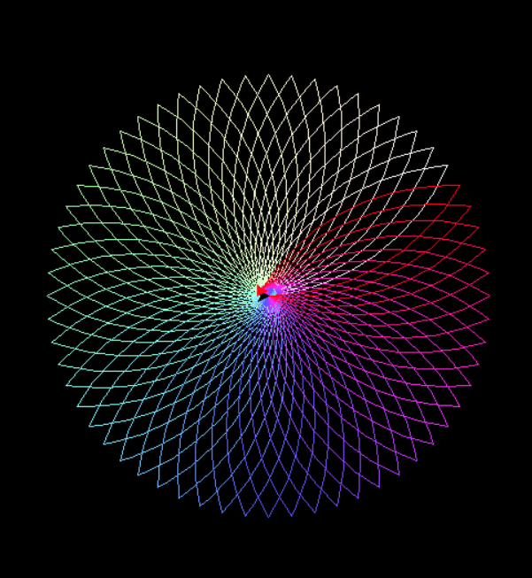

**Project Report: Rainbow Flower Drawing using Turtle Graphics**

**Objective:**
The objective of this project is to create an animated drawing of a flower with colorful petals using the Turtle graphics library in Python. The flower should have multiple petals, and each petal's color should vary in a rainbow-like pattern. The animation is meant to showcase the beauty of the flower with changing colors.

**Libraries Used:**
1. **turtle:** The Turtle graphics library is used for creating graphics and drawings in a simple and interactive way.
2. **colorsys:** This library is used for converting between different color representations. In this project, it's specifically used to convert from HSV (Hue, Saturation, Value) to RGB (Red, Green, Blue) for generating a variety of colors.

**Execution:**
1. **Setting up the Canvas:** The project begins by setting up a turtle canvas with a black background. The turtle's speed is set to 0 (fastest) for smooth rendering, and the tracer is set to 10 to update the screen at each step.

```python
turtle.setup(800, 800)
turtle.speed(0)
turtle.tracer(10)
turtle.width(2)
turtle.bgcolor("black")
```

2. **Drawing Petals:** The `draw_petal1` function is defined to draw a single petal of the flower. It uses the `circle` method to draw an arc and moves the turtle to create a petal shape. The main loop then iterates through 60 steps, changing the color of the petal and drawing two petals at each step, creating the appearance of a flower with 6 petals.

```python
for i in range(60):
    flower.color(cs.hsv_to_rgb(i/60, i/60, 1))
    draw_petal1(radius)
    flower.left(6)
    draw_petal1(radius)
```

3. **Animation and Cleanup:** The `tracer` function updates the screen at each step, creating the animation effect. Finally, the turtle is hidden, and the `turtle.done()` function is called to finish the drawing.

```python
turtle.hideturtle()
turtle.done()
turtle.bye()
```

**Results:**
The project successfully achieves its objective by creating an animated drawing of a flower with colorful petals. The colors transition through the rainbow spectrum, giving the flower a vibrant and visually appealing appearance.



**Conclusion:**
The project demonstrates the creative potential of Python's Turtle graphics library and how it can be used to create visually appealing animations. The combination of simple geometric shapes and color variations results in an aesthetically pleasing and interactive artwork. The project can be extended by adding more complex patterns, shapes, or interactivity for further exploration and artistic expression.
